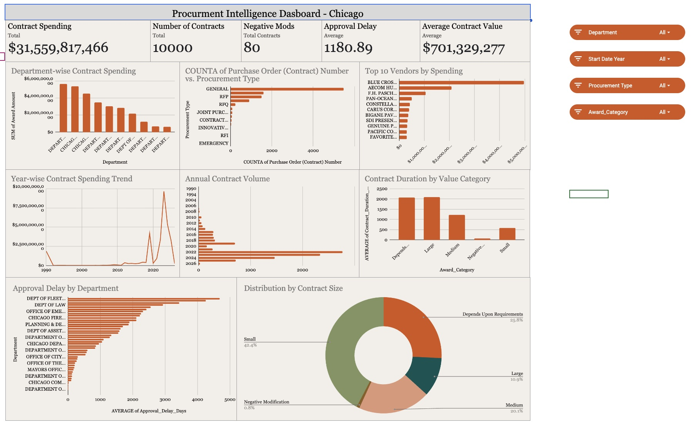
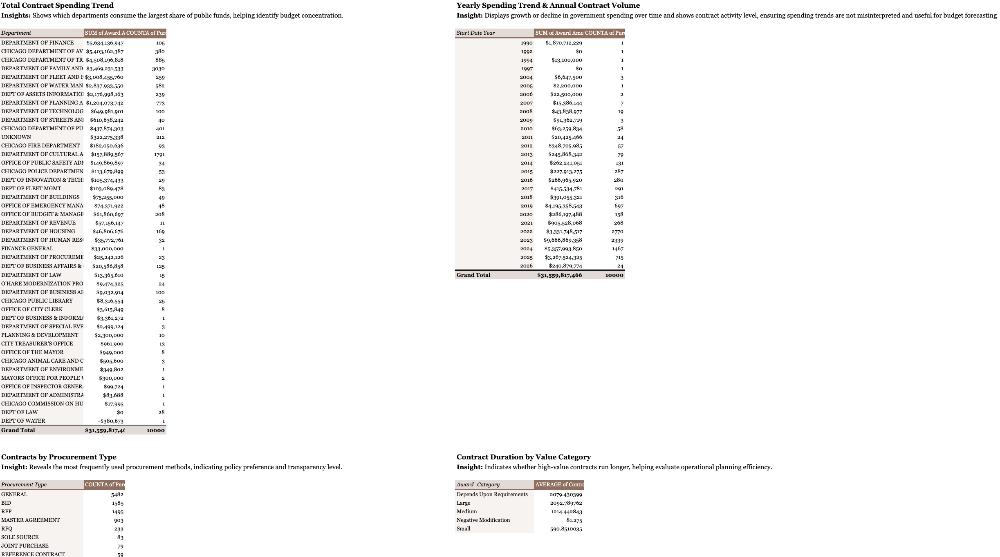

# Procurement Risk & Spending Efficiency Analytics of Public Contracts

## Project Overview

This project analyzes public procurement contracts of the City of Chicago to evaluate **spending efficiency, vendor concentration risk, and administrative approval delays**.  
Using a cleaned dataset of **10,000 contracts**, we built an **interactive Google Sheets dashboard** that transforms fragmented procurement data into actionable governance insights.

The goal is to determine:

- Whether procurement spending is **efficient and stable**
- If **hidden risks** exist in vendor dependency, approval bottlenecks, or spending volatility
- How analytics can support **transparent and data-driven public finance decisions**

---

## Dataset Analysis Screenshots

---

## Data Source

- **City of Chicago – Procurement Services Dataset**  
  https://data.cityofchicago.org/Administration-Finance/Contracts-Contract-PDF-Present/kzv2-52bx/about_data

---

## Project Files & Links

### Google Sheets

**Dashboard & Sheets (Link):**  
`https://docs.google.com/spreadsheets/d/1Cnf3jj6NT0suw8Ii0Rcd9aMXMn8todvxXGGIb1BfyuE/edit?usp=sharing`

### Presentation (PPT)

**Presentation Link (Canva):**
``

---

## Data Dictionary (Key Columns)

| Column                     | Description                      |
| -------------------------- | -------------------------------- |
| Purchase Order Number      | Unique contract identifier       |
| Award Amount               | Monetary value of contract       |
| Start Date / Approval Date | Used to calculate approval delay |
| Vendor Name                | Supplier receiving funds         |
| Department                 | Issuing government department    |
| Contract Duration Days     | End Date − Start Date            |
| Approval Delay Days        | Approval Date − Start Date       |
| Is High Value              | Flag for large contracts         |
| Is Negative Modification   | Flag for reduced contract value  |
| Award Category             | Value-tier segmentation          |

---

## Data Cleaning Notes

**Missing Values**

- Start/End dates logically imputed or excluded from time-based metrics
- Geographic blanks filled with standardized placeholders
- Procurement Type missing values filled as **“Not Specified”**

**Standardization**

- Vendor names converted to **uppercase** to avoid duplicates
- State codes normalized to **2-letter format**

**Feature Engineering**

- Approval Delay Days
- Contract Duration Days
- High-value, zero-award, and negative-modification flags
- Vendor key normalization
- Revision count per contract

These steps ensured **accurate aggregation, reliable KPIs, and valid trend analysis**.

---

## Dashboard Summary

The final dashboard contains:

- **KPI Cards**
  - Total Procurement Spend
  - Total Contracts
  - Negative Modifications Count
  - Average Approval Delay
  - Average Contract Value

- **Visualizations**
  - Year-wise spending trend (line chart)
  - Top vendors by spending (bar chart)
  - Department-wise expenditure comparison
  - Contract type distribution
  - Revision frequency distribution
  - Approval delay by department

- **Interactive Slicers**
  - Start Year
  - Department
  - Procurement Type
  - Award Category

This enables **real-time filtering and decision support**.

---

## Key Insights & Statistics

- **Budget Concentration:** Finance and Aviation departments control **>35%** of total spending.
- **Vendor Dependency:** One vendor receives **~15% of city funds**, creating systemic risk.
- **Process Inefficiency:** Average approval delay exceeds **1000 days**, indicating major bureaucracy.
- **Spending Structure:** Many contracts are **zero-award master agreements**, hiding future liabilities.

These findings highlight **financial concentration, operational delay, and governance risk**.

---

## Analysis Suggestions / Recommendations

- **Diversify vendor base** by splitting mega-contracts into smaller competitive packages
- **Fast-track low-value approvals** to reduce administrative backlog
- **Limit blanket contracts** to control uncertain future spending

**Expected Impact**

- Potential **billions in savings** from increased competition
- Significant **reduction in approval delays**
- Early detection of **failing or high-risk contracts**

---

## Forecasting / Future Scope (Optional)

- Predictive ML model for **approval delay estimation**
- NLP-based **automatic contract categorization**
- **Live API-connected dashboard** for real-time procurement monitoring

---

## Limitations

- Only **contract-level totals** available (no item-level pricing)
- Older records contain **more missing data**
- **Inflation and macroeconomic factors** not included in analysis

---

## Conclusion

This project converts raw procurement records into a **strategic governance intelligence system**.  
By quantifying:

- **$31B+ procurement scale**
- **Extreme approval delays**
- **Vendor concentration risks**

the dashboard provides a **clear roadmap for improving transparency, efficiency, and financial stability in public procurement**.
